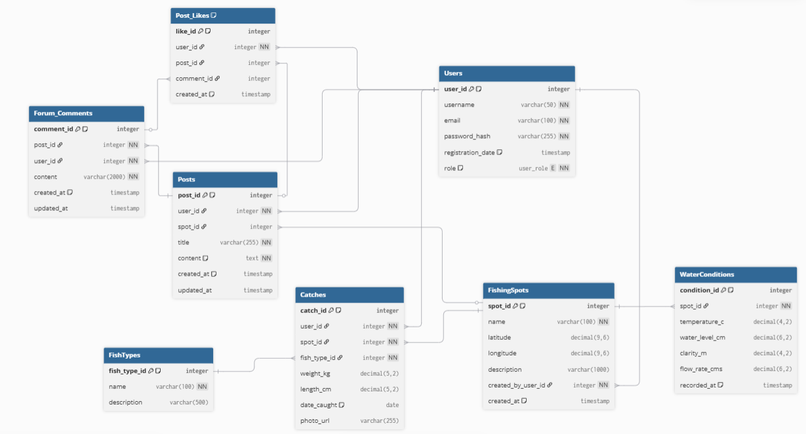

# Forum Wędkarskie - Projekt Aplikacji Bazodanowej

## 1. Ogólny Opis Projektu

**Forum Wędkarskie BassBaza** to projekt backendowej aplikacji konsolowej, która symuluje działanie forum internetowego dla pasjonatów wędkarstwa. Użytkownicy mogą rejestrować konta, logować się, tworzyć posty, komentować, polubić treści, a także dzielić się informacjami o miejscach wędkarskich i swoich połowach.

Celem projektu była demonstracja kluczowych aspektów pracy z relacyjną bazą danych, w tym:
*   Projektowanie i implementacja schematu bazy danych.
*   Realizacja operacji CRUD.
*   Obsługa transakcji i kontrola współbieżności.
*   Implementacja złożonych zapytań raportujących.

### Kluczowe Technologie
*   **Baza Danych**: Oracle Database 23c Free
*   **Środowisko**: Docker
*   **Backend**: Python 3
*   **Główne biblioteki**: `oracledb`, `bcrypt`

## 2. Model Danych

Schemat bazy danych został zaprojektowany w celu odzwierciedlenia kluczowych funkcjonalności forum. Składa się z **8 głównych tabel**:
*   `Users`: Przechowuje dane użytkowników, w tym bezpiecznie zahaszowane hasła (bcrypt) i role (np. `USER`, `ADMIN`).
*   `Posts`: Główna treść forum, w tym tytuł i zawartość (`CLOB`).
*   `Forum_Comments`: Komentarze powiązane z postami.
*   `Post_Likes`: Polubienia postów, z ograniczeniem jednego polubienia na użytkownika.
*   `FishingSpots`: Miejsca wędkarskie opisywane przez użytkowników.
*   `Catches`: Dziennik połowów, powiązany z użytkownikiem, miejscem i gatunkiem ryby.
*   `FishTypes`: Tabela słownikowa z gatunkami ryb.
*   `WaterConditions`: Historyczne dane o stanie wody, kluczowe dla operacji transakcyjnych.

 

## 3. Zaimplementowane Funkcjonalności

Aplikacja, obsługiwana z poziomu konsoli, pozwala na realizację następujących operacji:

### 3.1. Zarządzanie Użytkownikami i Treścią (CRUD)
*   **Rejestracja i Logowanie**: Bezpieczny system uwierzytelniania z wykorzystaniem haszowania haseł **bcrypt**.
*   **Zarządzanie Postami**: Użytkownicy mogą tworzyć posty, edytować własne treści oraz usuwać swoje posty (admin może usuwać wszystkie).
*   **Interakcje**: Zalogowani użytkownicy mogą dodawać komentarze, usuwać własne komentarze oraz "przełączać" polubienia (like/unlike).
*   **Zarządzanie Dziennikiem Połowu**: Zalogowany użytkownik ma własny dziennik połowu który może dowolnie edytować.

### 3.2. Operacje Transakcyjne
*   **Aktualizacja Stanu Wody**: Zaimplementowano procedurę `UpdateWaterConditions` w PL/SQL, która w ramach jednej transakcji blokuje rekord miejsca wędkarskiego (`FishingSpots`) przed jednoczesną modyfikacją przez wielu użytkowników. Mechanizm ten gwarantuje spójność danych i demonstruje kontrolę współbieżności.

### 3.3. Operacje Raportujące
*   **Raport Aktywności Użytkowników**: Aplikacja generuje ranking użytkowników na podstawie ich aktywności (liczba postów i komentarzy). Zapytanie to jest zoptymalizowane dzięki wykorzystaniu widoku `V_UserActivityReport`.

## 4. Kluczowe Aspekty Techniczne

Projekt demonstruje zaawansowane techniki pracy z bazą danych:
*   **Bezpieczeństwo Haseł**: Użycie `bcrypt` z losową "solą" dla każdego użytkownika.
*   **Integralność Danych**: Wykorzystanie klauzuli `ON DELETE CASCADE` zapewnia, że usunięcie posta automatycznie usuwa wszystkie powiązane z nim komentarze i polubienia, zapobiegając osieroconym rekordom.
*   **Logika w Bazie Danych**: Złożone operacje, takie jak przełączanie polubień (`Toggle_Post_Like`) i aktualizacja stanu wody, zostały zaimplementowane jako procedury składowane w PL/SQL, co zwiększa wydajność i hermetyzację logiki.
*   **Optymalizacja Zapytań**: Użycie widoków (np. `V_PostDetails`) do uproszczenia i zoptymalizowania zapytań odpytujących bazę z poziomu aplikacji w Pythonie.
*   **Automatyzacja**: Zastosowanie triggera (`trg_posts_update_timestamp`) do automatycznego aktualizowania daty modyfikacji posta.

## 5. Jak Uruchomić Projekt

1.  Upewnij się, że masz zainstalowany **Docker Desktop**.
2.  Uruchom kontener z bazą danych Oracle za pomocą dostarczonego polecenia `docker run`.
3.  Zainstaluj wymagane biblioteki Pythona: `pip install -r requirements.txt` (lub ręcznie `pip install oracledb bcrypt`).
4.  W pliku `db_config.py` upewnij się, że dane logowania są poprawne.
5.  Wykonaj skrypty SQL (tworzenie tabel, widoków, procedur) na bazie danych.
6.  Uruchom główną aplikację: `python main.py`.
